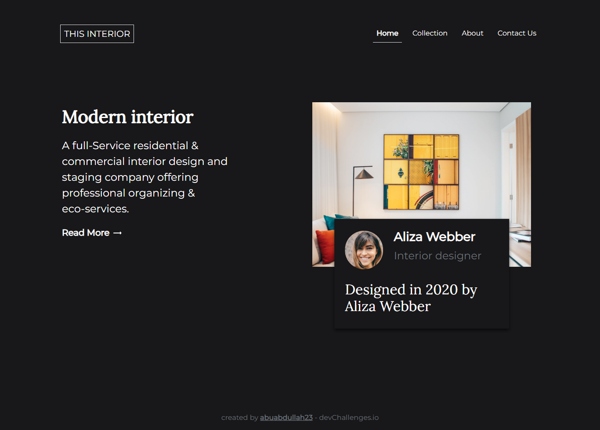

<!-- Please update value in the {}  -->

<h1 align="center">Modern interior</h1>

   Solution for a challenge from  <a href="http://devchallenges.io" target="_blank">Devchallenges.io</a>.

  <h3>
    <a href="https://abuabdullah23.github.io/dev-challenge-03-interior-consultant/">
      Demo
    </a>
     | 
    <a href="https://github.com/abuabdullah23/dev-challenge-03-interior-consultant">
      Solution
    </a>
     | 
    <a href="https://devchallenges.io/challenges/Jymh2b2FyebRTUljkNcb">
      Challenge
    </a>
  </h3>

<!-- TABLE OF CONTENTS -->

## Table of Contents

- [Table of Contents](#table-of-contents)
- [Overview](#overview)
  - [Built With](#built-with)
- [Features](#features)
- [Acknowledgements](#acknowledgements)
- [Contact](#contact)

<!-- OVERVIEW -->

## Overview

Introduce your projects by taking a screenshot or a gif. Try to tell visitors a story about your project by answering:

- My <a href="https://abuabdullah23.github.io/dev-challenge-03-interior-consultant/">
      Demo
    </a> site is here.
- Learned/improved: Responsive Navbar.

### Built With

<!-- This section should list any major frameworks that you built your project using. Here are a few examples.-->

- HTML
- CSS
- Bootstrap Framework

## Features

<!-- List the features of your application or follow the template. Don't share the figma file here :) -->

This application/site was created as a submission to a [DevChallenges](https://devchallenges.io/challenges) challenge. The [challenge](https://devchallenges.io/challenges/Jymh2b2FyebRTUljkNcb) was to build an application to complete the given user stories.

- Responsive Navigation bar.
- On mobile, when I select the hamburger menu, I can see a navigation

## Acknowledgements

<!-- This section should list any articles or add-ons/plugins that helps you to complete the project. This is optional but it will help you in the future. For exmpale -->

- [Steps to replicate a design with HTML and CSS](https://devchallenges-blogs.web.app/how-to-replicate-design/)
- Bootstrap5 version.

## Contact

- GitHub [abuabdullah23](https://github.com/abuabdullah23/)

